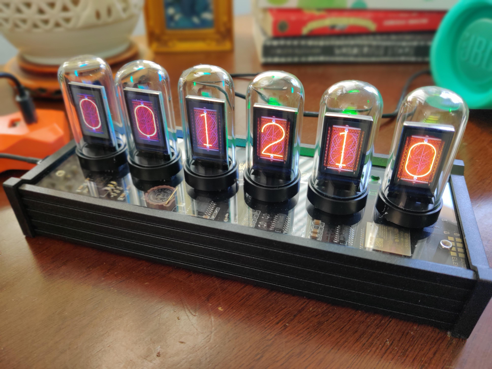
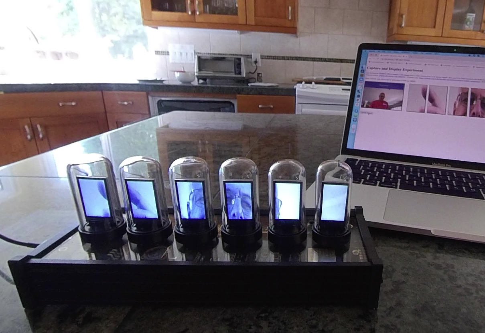

# ElekstubeIPSHack - Hacking the Elekstube IPS ESP32 TFT based clock

[EleksTube IPS](https://www.banggood.com/Pseudo-glow-Tube-Programmable-Display-IPS-Screen-RGB-Clock-Desktop-Creative-Ornaments-Digital-Clock-Colorful-LED-Picture-Display-p-1789259.html?rmmds=myorder&cur_warehouse=CN) is an ESP32-based digital clock. It appears to be the first in a wave of new 32-bit network-enabled multiple display products.



[EleksMaker](https://eleksmaker.com/) designed it to appear to have a [Nixie Tube display](https://en.wikipedia.org/wiki/Nixie_tube). Of course, it's all an ingenious fake! An ESP32 processor drives 6 TFT LCD displays. USB C connectors provide power and communication to a FTDI microcontroller programmer using a pre-programmed bootloader. The environment is familiar to users of Arduino microcontroller boards, C/C++ languages, Arduino IDE, and the ESP32 processor.

The board features 3 push buttons for set-up configuration, a power button, a real-time clock with battery backup, a power control chip to dim the displays, and 6 screens. The screens are IPS 1.14 Inch 8PIN Spi Hd Tft Lcd-screen with ST7789 driver IC. They display 135 by 240 pixels and are supported by the TFT_eSPI library.

All of this feels like an Arduino playground. I love it right out of the box! EleksTube IPS comes pre-programmed with its own firmware. At the time of writing this EleksMaker had not published the source-code to their firmware. The firmware implements its own protocol for a Windows-based application to upload new images for the clock function. [Check here for details](http://wiki.eleksmaker.cn/doku.php?id=ips).

I'd also like to build some new experiences with it:

- Getting the time from a Network Time Protocol (NTP) server on the Internet
- Uploading images and video to the clock from a Web browser
- Configuration of time, Wifi access, start-up animation from a Web browser

I started a discussion [Hacking the EleksTube IPS Clock - anyone tried it?](https://www.reddit.com/r/arduino/comments/mq5td9/hacking_the_elekstube_ips_clock_anyone_tried_it/) on Reddit. [@SmittyHalibut](https://www.reddit.com/user/SmittyHalibut/), [@RedNax67](https://www.reddit.com/user/RedNax67/), and others worked to build an open-source firmware. @SmittyHalibut's firmware is [here](https://github.com/SmittyHalibut/EleksTubeHAX). It uses the ESP32 SPIFFS filesystem to store images. And it implments class libraries for buttons, backlights, RTC, and displays.

## Using EleksHack Alternative Firmware

This repository is an alternative firmware for the clock. Compile the firmware from source code using the instructions below, or upload the compiled firmware image (from /bin in this repository) to your clock. The clock has 2 USB C ports, plug a cable between your computer and the clock. Use Arduino IDE to compile and upload the /EleksHack/ElecksHack.ino sketch from the source code. Or follow the next section to upload the pre-built firmware.

### Uploading the pre-compiled binary

As an easy alternative to compiling the source code, the /bin directory has an [Esptool](https://github.com/espressif/esptool) created binary file.

We recommend you make a backup of your clock's original firmware before taking any of these steps. Use this command:

python esptool.py -b 115200 --port /dev/cu.usbserial-141210 read_flash 0x00000 0x400000 flash_4M.bin

Replace the USB port above with your own. On my MacOS 11.3.1 and Arduino IDE 1.8.13 puts esptool.py at /Users/frankcohen/Documents/Arduino/hardware/espressif/esp32/tools/esptool.py. I change to that directory, then run the above command from a Terminal window. It appears as:

```frankcohen@FCohenMac2020 tools % python esptool.py -b 115200 --port /dev/cu.usbserial-141210 read_flash 0x00000 0x400000 flash_4M.bin
esptool.py v2.8
Serial port /dev/cu.usbserial-141210
Connecting....
Detecting chip type... ESP32
Chip is ESP32D0WDQ5 (revision 1)
Features: WiFi, BT, Dual Core, 240MHz, VRef calibration in efuse, Coding Scheme None
Crystal is 40MHz
MAC: a4:e5:7c:47:20:dc
Uploading stub...
Running stub...
Stub running...
4194304 (100 %)
4194304 (100 %)
Read 4194304 bytes at 0x0 in 383.0 seconds (87.6 kbit/s)...
Hard resetting via RTS pin...
frankcohen@FCohenMac2020 tools %
```

Esptool.py creates a 4 Mbyte binary backup file of your clock's existing firmware.

Then, upload the binary from this repository /EleksHack/bin/ to the clock using this command:

python esptool.py -b 115200 --port /dev/cu.usbserial-141210 write_flash --flash_freq 80m 0x000000 elekshack.bin

Replace the USB port above with your own.

## Accessing The Menu

Upon start-up the clock is a Wifi access point with the SSID of EleksHack and the password thankyou. Connect to the access point from your mobile or laptop device. Point your browser to [192.168.1.1](http://192.168.1.1) to view the main menu.

The clock has 2 shows: Play Clock, Play Images. The clock show is the normal EleksTube IPS clock display. The image show displays a random JPG formatted image on a random display (of the 6 displays).

### Play Clock ###
Requires the digits of the clock to be stored in BMP format. For example, /1.bmp is the image file for the number 1. Use the Menu command Manage Media and the Upload function to store a BMP formatted file to the internal (SPIFFS) file system. Manage Media also shows the files in the file system, and the delete link removes the file. Nixie tube looking BMP files are in the /EleksHack/data directory of the source repository.

EleksTube IPS ships with SPIFFS formatted using the old and deprecated SPIFFS library. The alternative firmware uses the replacement for SPIFFS library... called LittleFS. In the Manage Media page use the Format SPIFFs File System before uploading images.

By default the clock runs in the 'Play Clock' show. The firmware will display the value stored in the Real Time Clock chip. If you do not see the clock images on the displays you will need to upload the image files to the clock. Use the Manage Media command in the main menu (in your browser). Upload the images from the /EleksHack/data directory.

To get the time from a Network Time Protocol (NTP) server on the Internet, create a Wifi connection from the clock to your nearby Wifi access point. Click Connect To Wifi from the menu. Your browser shows a scan of available Wifi networks. Click on one, enter a password, and connect. Once connected the NTP server time updates the clock time and stores the time value in the Real Time Clock chip (RTC).

**NOTE:** This sketch uses self-signed certificates to operate using HTTPS protocol. A self-signed certificate is a security certificate that is not signed by a certificate authority. This sketch makes its own certificate each time it starts. These certificates are easy to make and do not cost money. However, they do not provide all of the security properties that certificates signed by a CA aim to provide. For example, the Connect To Wifi page transmits passwords. It is likely that someone with light security skills could crack the certificate and learn your passwords. I recommend you use a Wifi station with no password. Or, do not use this control. Also, most browsers will ask you to override a security alert to use the self-signed certificate.

### Play Images ###
Play Images is something I personally wanted. I use it to randomly show pictures of my children. Both my children are in love and life is good! Click Play Images from the main menu, then click Play. It picks a JPG image from the file system approximately every 2 seconds.

### Photobooth ###
Captures a still image from a video stream from your laptop camera. Slices into 6 JPEG images. Uploads the images to the EleksTube IPS SPIFFS. Displays the images on the 6 displays.



Photobooth uses your laptop, tablet, or mobile phone's camera to capture an image, slice it into 6 smaller images, then display the images on the EleksTube IPS. It uses the <a href="https://developer.mozilla.org/docs/Web/API/WebRTC_API/Taking_still_photos" target="_blank">WebRTC</a> API standard and should operate on all Web browsers. I found instructions <a href="https://github.com/mdn/samples-server/tree/master/s/webrtc-capturestill">here</a>.

# How to build this firmware
Unfortunately building this firmware from the source code is not as easy as: Arduino IDE 1.8.13 on MacOS 11.3.1. Choose Tools -> Board -> ESP Arduino (in sketchbook) -> ESP Dev Module. Set Tools -> Upload speed to 115200. There are many dependencies on external libraries:

### Download the source code

Use the Code pop-up menu in Github and select the Download Zip command. Extract the source code from the Zip file.

### Setup Arduino IDE
I use [Arduino IDE 1.8.13](https://www.arduino.cc/). Please let me know if it does not work on versions before or later.

### Windows device driver
Windows users should follow Arduino IDE instructions to install device drivers to use the USB ports to communicate with the clock.

### Install ESP32 board support from Espressif
Follow instructions to add ESP32 support to Arduino IDE at:
https://github.com/espressif/arduino-esp32/blob/master/docs/arduino-ide/mac.md

Software drivers and utilities for ESP32 are at:
https://github.com/espressif/arduino-esp32
https://github.com/nodemcu/nodemcu-firmware/tree/dev-esp32

On MacOS 11.3.1 I needed to patch esptool.py following https://github.com/espressif/arduino-esp32/issues/4408 and changing the +x perms too

In Arduino IDE use ESP32 Dev Board as Board selection. The default configs in the Tools menu should be fine. The important ones are:
* Flash Size: 4MB
* Partition Scheme: Any that includes at least 1MB for SPIFFS.  I use the "Default 4MB: 1.2MB App, 1.5MB SPIFFS" one.
* Port: Set it to whatever serial port your clock shows up as when plugged in.

### Install Libraries
All these libraries are in Library Manager, except for the Jpeg decoder library that must be downloaded in Zip form and installed using Sketch -> Include Library -> Install from Zip in Arduino IDE.  Several libraries have very similar names, so make sure you select the correct one based on the author.
The listed "developed on" versions are just the versions I had installed while developing this code.  Newer (or possibly older) versions should be fine too.

Sketch -> Include Library -> Library Manager
* `NTPClient` by Fabrice Weinberg (developed on v3.2.0)
* `Adafruit NeoPixel` by Adafruit (developed on v1.8.0)
* `DS1307RTC` by Michael Margolis (developed on v1.4.1)
* `TFT_eSPI` by Bodmer (developed on v2.3.61)
* `Time` by Michael Margolis (developed on v1.6.0)
* `LittleFS' by lorol (developed on v1.0.6)
* `ESP32 HTTPS Server` by Frank Hessel fhessel (developed on v1.0.0)

And download the zip and install in Arduino IDE using Sketch -> Include Library -> Add ZIP Library:
* `Jpeg decoder library`, version Apr 24, 2021 at https://github.com/Bodmer/TJpg_Decoder

### Configure the `TFT_eSPI` library
**IMPORTANT** You have to do this after every time you install or update the `TFT_eSPI` library!

The full documentation for this is in the `TFT_eSPI` library, but tl,dr:
* Edit `Arduino/libraries/TFT_eSPI/User_Setup_Select.h`
* Comment out all `#include` lines.  (The only one that comes from install is `#include <User_Setup.h>`.)
* Add a `#include` line pointing to `User-Setup.h` in this code.
  * eg: `#include </home/foo/src/EleksTubIPSHack/EleksHack/User_Setup.h>`
  * Obviously, update the path to point to where ever you keep your code.  Mac and Windows paths will look different.

### Restart Arduino
After installing the ESP32 support, all the libraries, restart Arduino IDE to make sure it knows everything is present.

### Upload New Firmware
Use the Arduino IDE Upload command to compile and upload the firmware to your clock. Compile (Ctrl-R) and Upload (Ctrl-U) the code.  At this point, it should upload cleanly and successfully.  You'll see the clock boot up messages on the 6 displays on the clock. The clock doesn't have any bitmaps to display on the screen yet.

### Debug Logging to the Serial Monitor
Use Arduino IDE Serial Monitor to view debugging details as the clock operates. For example, the alternative firmware prints the connected Wifi addresses to the serial monitor when the station mode connects.

### Upload Bitmaps
The repository comes with a set of BMP files, nixie tubes from the original firmware, in the `/EleksHack/data` directory. Connect to the clock's Wifi access point, use the main menu, Manage Media command, and upload the bitmaps.

### Custom Bitmaps (Optional)
If you want to change these:

* Create your own BMP files.  Resolution must be 135x240 pixels, 24bit RGB.
* Name them `0.bmp` through `9.bmp` and put them in the `data/` directory.

Then use the Manage Media command to upload.

# Documentation

## Hardware
* Microcontroller: ESP32-WROOM-32D
  * [Datasheet](https://www.espressif.com/sites/default/files/documentation/esp32-wroom-32d_esp32-wroom-32u_datasheet_en.pdf)
  * [Technical Reference Manual](https://www.espressif.com/sites/default/files/documentation/esp32_technical_reference_manual_en.pdf)
* Displays: [TFT 1.14" 135x240](https://www.aliexpress.com/item/32564432870.html)  (includes pinout of ribbon connector)
  * ST7789 controller [Datasheet](https://www.rhydolabz.com/documents/33/ST7789.pdf)
* RGB LED: SK6812 side emmitting
  * [Datasheet](http://www.ledlightinghut.com/files/SK6812%20side%204020.pdf)
  * NeoPixel/WS2812 compatible.

## Libraries
* Talking to displays: [TFT_eSPI](https://github.com/Bodmer/TFT_eSPI)
* Real Time Clock: [DS3231 RTC](https://circuitdigest.com/microcontroller-projects/esp32-real-time-clock-using-ds3231-module)
* NeoPixel library for RGB LEDs (link coming)

# Hardware
@SmittyHalibut notes from reverse engineering the board

## Display boards
The card edge connector has 13 connection points on each side, but both sides are tied together, so there are only 13 unique pins.

The socket on the board is oriented so that Pin 1 is on the RIGHT SIDE (look for the little arrow on the top of the socket.)  So
the documentation below is RIGHT TO LEFT.

1. WS2812 In
2. WS2812 Out
3. TFT pin 5, SDA, ESP32 pin 37, IO23, VSPID
4. TFT pin 6, SCL, ESP32 pin 30, IO18, VSPICLK
5. TFT pin 4, RS (Register Select, or DC Data Command), ESP32 pin 10, IO25
6. TFT pin 3, RESET (active low),  ESP32 pin 11, IO26
7. TFT pin 8, Chip Select, driven by 74HC595
8. WS2812, GND (Tied to 13)
9. N/C
10. TFT pin 1 and 7, Vdd and LEDA (Tied to 12)
11. TFT pin 2, GND
  * Tied to system ground through a MOSFET, controlled by ESP32 pin 12, IO27, so the displays can be completely turned off.
  * (If I (SmittyHalibut) were doing this, I'd have used a P channel MOSFET and controlled LEDA, which would allow dimming as well as completely shutting it off. Oh well.)
12. TFT pin 1 and 7, Vdd and LEDA (Tied to 10)
13. WS2812, GND  (Tied to 8)

## Chip Select Shift Register
There's a [74HC595](https://www.arduino.cc/en/Tutorial/Foundations/ShiftOut)
([datasheet](https://www.arduino.cc/en/uploads/Tutorial/595datasheet.pdf))
that drives the 6 SPI Chip Select lines on the displays.  Chip Select lines are Active Low,
so write 1s to the displays you do NOT want to update, a 0 to the display you want to update.

Q0 is the most recent bit written to the shift register, Q7 is the oldest bit written.

Outputs:
* Q0: Hour Tens
* Q1: Hour Ones
* Q2: Minute Tens
* Q3: Minute Ones
* Q4: Seconds Tens
* Q5: Seconds Ones
* Q6 and Q7: Unused, not connected.

Inputs:
* Ds (Data In): ESP32 pin 13, IO14, GPIO14
* /OE (Output Enable): Strapped to Ground, always enabled.
* STcp (Storage Register Clock Input): ESP32 pin 28, IO17, GPIO17
* SHcp (Shift Register Clock Input): ESP32 pin 27, IO16, GPIO16

## WS2812, Neopixel (?) RGB LEDs
They only require a single GPIO pin to drive all 6 LEDs.  They are driven in reverse order, right to left.  The first LED is Seconds Ones, the sixth LED is Hours Tens.

* ESP32 pin 14, IO12

## Buttons
All 4 buttons are externally pulled up (an actual 10k resistor!) and shorted to ground by the button.

* `<<<`: ESP32 pin 9, IO33
* `MODE`: ESP32 pin 8, IO32
* `>>>`: ESP pin 7, IO35
* `POWER`: ESP pin 6, IO34

## RTC DS3231
The DS3231 ([datasheet](https://datasheets.maximintegrated.com/en/ds/DS3231.pdf)) is an I2C device, and a very common one at that. Lots of good documentation and libraries already.

* SCL: ESP32 pin 36, IO22
* SDA: ESP32 pin 33, IO21

## Next steps

Implement HTTPS to protect Wifi connection passwords
https://esp32.com/viewtopic.php?t=19452

Let the ESP32 select Wifi connections based on signal strength and availability
https://diyprojects.io/esp32-how-to-connect-local-wifi-network-arduino-code/#.YKxQz5NKiog

## License
This work is distributed for free under a GPL version 3 open-source license.

## Contributers
[@FrankCohen](https://www.reddit.com/user/frankcohen), [@SmittyHalibut](https://www.reddit.com/user/SmittyHalibut/), [@RedNax67](@https://www.reddit.com/user/RedNax67/)

Please feel free to jump-in here. Make a contribution, make a fork, make a comment, open a bug report. The water is warm and all are welcome.
